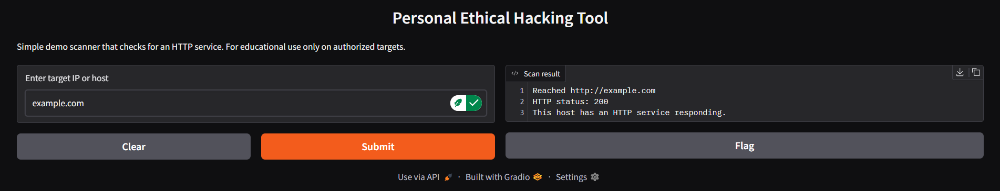

Personal Ethical Hacking Tool 🛡️

A simple ethical hacking demo built in Python with a Gradio web interface.  
This tool performs an **HTTP reachability check** against a target host and displays the results in a clean, terminal-style output panel.

> ⚠️ **Ethical Use Notice:**  
> Use this tool **only** on systems you own or are explicitly authorized to test.  
> This project is for learning and demonstration purposes only.

---

✨ Features

- 🔍 **HTTP Reachability Check**  
  Sends an HTTP GET request (`http://<target>`) and reports:
  - Whether the host responded  
  - HTTP status code  
  - Basic connection summary  

- 🖥️ **Gradio Web Interface**  
  Clean, responsive UI with:
  - Input bar  
  - Terminal-style output panel  
  - Clear / Submit / Flag buttons  

- ☁️ **Hosted Online**  
  Fully deployed on Hugging Face Spaces — includes both:
  - A project page  
  - A live interactive demo interface

---

🚀 Live Demo

🔗 **Hugging Face Space (project page):**  
https://huggingface.co/spaces/goodjobbruh/ethicalhacking-tool

🔗 **Live Web Interface (interactive demo):**  
https://goodjobbruh-ethicalhacking-tool.hf.space

Use the **interactive web interface** to test the tool without running anything locally.

---

🖼 Interface Preview

Below is what the tool looks like when running:



---

📦 How to Run Locally

1. Clone this repository

```bash
git clone https://github.com/YOUR_USERNAME/YOUR_REPO_NAME.git
cd YOUR_REPO_NAME
